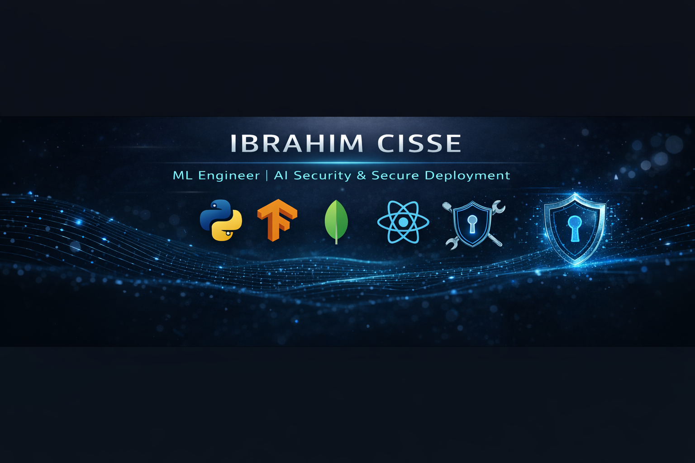

  

# 👋 Hi, I'm Ibrahim Cisse

### ML Engineer | AI Security & Secure Deployment  
📍 Gatineau, Canada  
🔐 Focused on Secure AI Systems  
🚀 Open to AI / Cybersecurity Internships & Junior Roles  

---

## 🧠 À propos de moi | About Me

🇫🇷 Version Française Ajustée

Je suis étudiant en intelligence artificielle spécialisé en ingénierie des systèmes d’apprentissage automatique et en déploiement sécurisé d’applications.
Je possède également des compétences en cybersécurité, notamment en configuration de pare-feu (firewall), en sécurisation d’API et en principes fondamentaux de protection des systèmes.

Je développe des projets combinant intelligence artificielle, développement logiciel et cybersécurité, avec un intérêt particulier pour la conception de systèmes IA robustes, sécurisés et prêts pour la production.

🎯 Objectif : concevoir des solutions d’intelligence artificielle performantes et sécurisées afin de résoudre des problématiques concrètes en entreprise et dans la société.

🇬🇧 Adjusted English Version

I am a Computer Science student specializing in Machine Learning Engineering and secure application deployment.
I also have competencies in cybersecurity, including firewall configuration, API security, and system protection fundamentals.

I build projects that combine artificial intelligence, software engineering, and cybersecurity principles, with a strong interest in designing robust, secure, and production-ready AI systems.

🎯 Goal: design intelligent and secure AI-driven solutions to solve real-world business and societal challenges..

I build AI solutions that are not only intelligent — but secure and production-ready.

Core strengths:
- Machine Learning Engineering
- Fraud Detection Systems
- Identity Verification Pipelines
- Secure Backend APIs
- Cybersecurity Fundamentals & Pentesting Basics

---

## 🤖 AI & Machine Learning

- Supervised & Unsupervised Learning
- Feature Engineering & Model Optimization
- Model Explainability (SHAP)
- Fraud Detection Models
- Identity Verification Systems
- NLP & Computer Vision Foundations

**Tech Stack:**  
## 🛠 Tech Stack

---

### 👨‍💻 Languages

---

### 🤖 AI & Data

---

### 📊 Data Analytics & Visualization

---

### 🌐 Web & APIs

---

### ☁️ Cloud & DevOps

---

### 🔐 Cybersecurity

---

### 🗄 Databases & Tools

---

## 🔐 Cybersecurity & AI Security

- Kali Linux Environment
- Nmap Scanning & Reconnaissance
- Vulnerability Assessment Basics
- OWASP Top 10 Awareness
- API Authentication (JWT)
- Role-Based Access Control (RBAC)
- Secure Model Deployment Concepts
- Data Privacy Principles

Interest in:
- AI model robustness
- Secure ML pipelines
- Adversarial awareness
- Secure-by-design architecture

---

## ⚙️ Deployment & Engineering

- FastAPI
- RESTful APIs
- Docker Containerization
- Git & GitHub
- Environment Configuration (.env)
- Secure API Hardening

Deployment philosophy:
> Security should be integrated into the ML lifecycle — not added after.

---

## 📂 Featured Projects

### 🔍 Fraud Detection API
Machine learning model deployed via FastAPI with SHAP explainability and secured endpoints.

### 🪪 AI Identity Verification System
Document validation + face matching pipeline with authentication layer.

### 🔐 Secure ML API Prototype
Role-protected AI API demonstrating secure deployment practices.

---

## 📊 GitHub Stats

  
  

---

## 🎯 Career Objective

Seeking opportunities in:
- Machine Learning Engineering
- AI Security
- Secure Backend Development
- Cybersecurity (Entry-Level)

I aim to contribute to building intelligent and secure AI-driven systems.

---

## 📫 Contact

LinkedIn: [[Add Your Link]](https://www.linkedin.com/in/ibrahim-cisse-633499313/)
